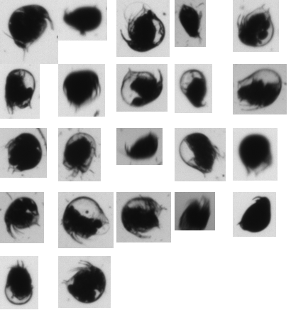
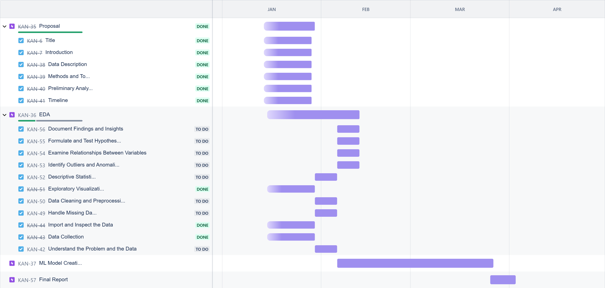

# Automating Zooplankton Classification Using Geometric and Environmental Features

## 1. Introduction
- **Research Question**: Make machine learning model to classify zooplankton species based on their images and features like geometric environmental.
- **Significance**: Zooplankton are vital indicators of freshwater ecosystem health. Current manual classification is labor-intensive and prone to observer bias.

## 2. Data Description
- **Source**: Ministry of Natural Resources and Forestry, Ontario.
- **Structure**:
  - **Images**: `.tif` mosaics containing zooplankton images.
  - **Features**:
    - **Geometric**: Transparency, symmetry, compactness, etc.
    - **Environmental**: Latitude, longitude, depth, distance to shore.
  - **Response Variable**: Manually assigned to 31 classes in "Class" column (focusing on key species like Calanoid_1, Cyclopoid_1, Bosmina_1, etc.).
- **Challenges**:
  - Missing `.csv` data.
  - Erroneous image dimensions.
  - Class imbalance.

## 3. Methods and Tools
- **Tools**:
  - **Data Preprocessing**: `Pandas` library from Python for handling missing values and cleaning data.
  - **Modeling**: TensorFlow or PyTorch for classification tasks.
  - **Analysis**: `Pandas` for exploratory data analysis and visualization.

## 4. Preliminary Analysis
- **Summary Table**:
  - A table summarizing species distributions and highlighting data imbalances (to be included).
- **Visual Example**:
  - The same species can have different shapes due to variations in camera angle, lighting, and positioning.
  - Below is an example of 22 images of Bosmina_1 plankton, showing the morphological differences within a single species.
  

## 5. Timeline
